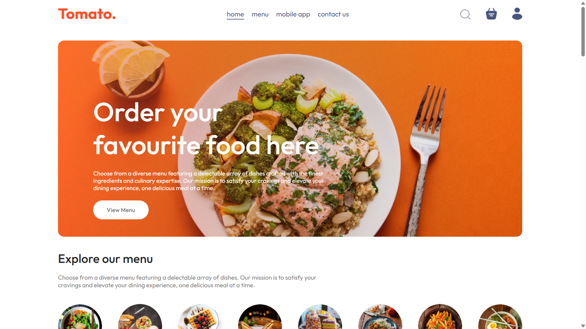
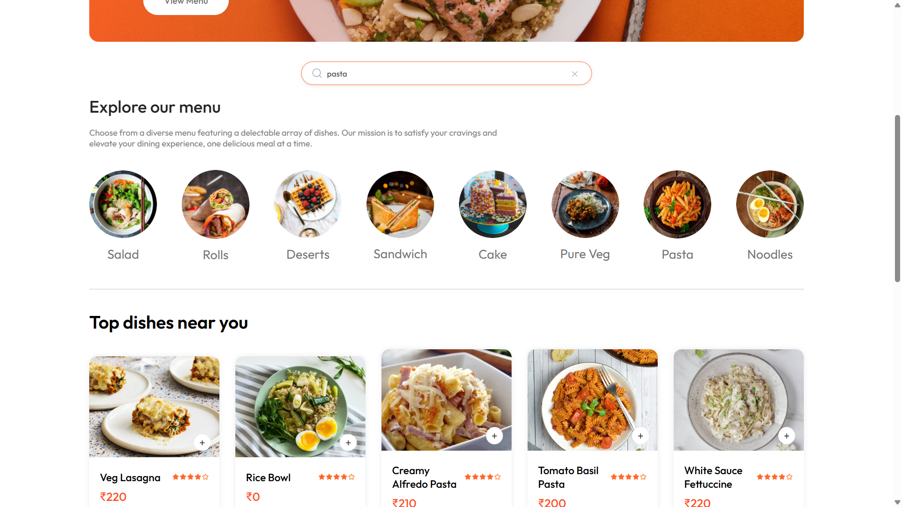
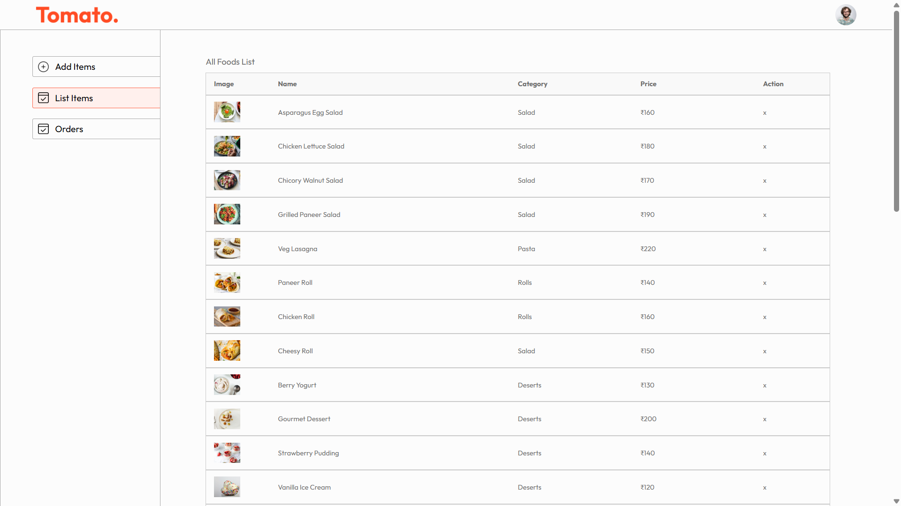

# 🍅 Tomato — Full-Stack Food Delivery Web App


A full-stack food delivery platform where users can browse dishes, search and filter by category, pay securely via Razorpay, and track their orders — with a dedicated admin panel to manage the menu and update order statuses.

🔗 **Live Demo:** [tomato-frontend.vercel.app](https://food-del-seven-nu.vercel.app/) &nbsp;|&nbsp; **Admin Panel:** [tomato-admin.vercel.app](https://food-del-o4lf.vercel.app/)

---

## 📸 Screenshots

| Home Page | Search | Admin Panel |
|-----------|--------|-------------|
|  |  |  |

---

## ✨ Features

### Customer App
- 🔐 Register & login with JWT-based authentication
- 🔍 Live search bar — filter dishes by name or category in real time
- 🗂️ Category-based filtering with combined search support
- 🛒 Add / remove items from cart with live quantity updates
- 💳 Secure payments via **Razorpay** (UPI, cards, netbanking, wallets)
- 📦 Place orders and view full order history
- 📱 Fully responsive design

### Admin Dashboard
- ➕ Add, update, and delete food items with image uploads
- 📋 View all incoming orders
- 🔄 Update order status (Food Processing → Out for Delivery → Delivered)

---

## 🛠️ Tech Stack

| Layer | Technology |
|---|---|
| Frontend | React.js, React Router, Context API |
| Backend | Node.js, Express.js, REST API |
| Database | MongoDB, Mongoose |
| Auth | JWT, bcrypt |
| Payments | Razorpay (HMAC SHA256 signature verification) |
| Image Uploads | Multer |
| Deployment | Vercel (Frontend & Admin), Render (Backend) |

---

## 🚀 Getting Started

### Prerequisites
- Node.js v18+
- MongoDB (local or [MongoDB Atlas](https://www.mongodb.com/atlas))
- Razorpay account ([free test account](https://razorpay.com))

### 1. Clone the repo
```bash
git clone https://github.com/shrankhla-jawla/food-del.git
cd food-del
```

### 2. Backend
```bash
cd backend
npm install
```

Create a `.env` file inside `/backend`:
```env
PORT=4000
MONGODB_URI=your_mongodb_connection_string
JWT_SECRET=your_jwt_secret
RAZORPAY_KEY_ID=rzp_test_xxxxxxxxxxxx
RAZORPAY_KEY_SECRET=your_razorpay_secret
```

```bash
npm run server
```

### 3. Frontend
```bash
cd ../frontend
npm install
npm run dev
```

### 4. Admin Panel
```bash
cd ../admin
npm install
npm run dev
```

---

## 📁 Project Structure

```
food-del/
├── frontend/                   # Customer-facing React app
│   └── src/
│       ├── components/
│       │   ├── SearchBar/      # Live search (custom feature)
│       │   ├── FoodDisplay/
│       │   ├── FoodItem/
│       │   ├── Navbar/
│       │   └── ...
│       ├── pages/
│       │   ├── Home/
│       │   ├── Cart/
│       │   ├── PlaceOrder/     # Razorpay checkout (custom feature)
│       │   └── MyOrders/
│       └── Context/
│           └── StoreContext.jsx
├── admin/                      # Admin dashboard (React)
│   └── src/
│       └── pages/
│           ├── Add/
│           ├── List/
│           └── Orders/
└── backend/                    # Express REST API
    ├── controllers/
    ├── models/
    ├── routes/
    └── middleware/
```

---

## 🔌 API Endpoints

| Method | Endpoint | Description |
|--------|----------|-------------|
| POST | `/api/user/register` | Register new user |
| POST | `/api/user/login` | Login & receive JWT |
| GET | `/api/food/list` | Get all food items |
| POST | `/api/food/add` | Add food item (Admin) |
| DELETE | `/api/food/remove` | Remove food item (Admin) |
| POST | `/api/order/place` | Place order & create Razorpay order |
| POST | `/api/order/verify` | Verify Razorpay payment signature |
| POST | `/api/order/userorders` | Get logged-in user's orders |
| GET | `/api/order/list` | Get all orders (Admin) |
| POST | `/api/order/status` | Update order status (Admin) |

---

## 💳 Test Payments

| Method | Details |
|--------|---------|
| Card | `4111 1111 1111 1111` · Any future expiry · Any CVV |
| UPI | `success@razorpay` |
| OTP | `1234` |

---

## 🌱 Planned Improvements

- [ ] Real-time order tracking with WebSockets
- [ ] Email notifications on order confirmation
- [ ] Promo code / discount system
- [ ] User profile & saved addresses

---

## 👩‍💻 Author

**Shrankhla Jawla** — B.Tech 3rd Year  
🔗 [LinkedIn](https://www.linkedin.com/in/shrankhla-jawla-261b6bb4) &nbsp;|&nbsp; [GitHub](https://github.com/shrankhla-jawla)

---

## 📄 License

MIT